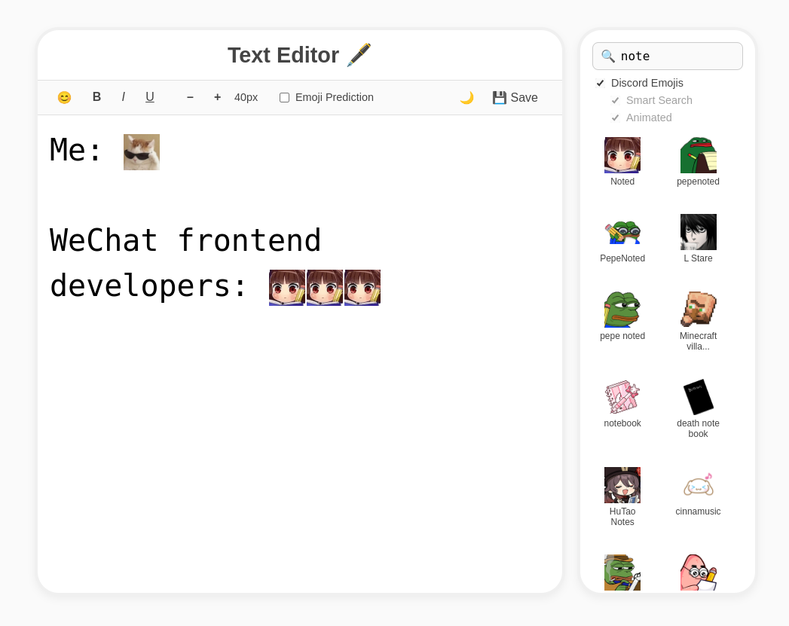

# Text Editor with Emoji Search Engine 🔍

### Project overview

This project implements a text editor with emoji search and prediction, natively supporting an unlimited number of custom and animated emojis, rendered as normal inline text characters. It integrates key information retrieval techniques, including crawling, results ranking, and the use of Large Language Models.

The system is deployed using __Docker__ for containerization, with __MongoDB__ as the database (2 tables – `Emojis` and `Tags`), __Python__ as the backend for running 2 pre-trained BERT models, and __Node.js__ based web application as a single entry point for user and central hub (plus also running Word2Vec model). Emojis search and prediction are both based on cosine similarity ranking; the only difference lies in the model used to convert the input query vector into an embedding vector.

### Architecture diagram

 

Available functionality:

- Emoji search – search for custom emojis using Word2Vec model or for default Unicode emojis with normal search
- Emoji prediction – predict emoji at the end of the sentence via fine-tuned or base BERT models
- Text editor – default features of a text editor, e.g., font style, font size, save, dark mode

 

Folders structure:

- [`backend`](./backend) – web application server
- [`frontend`](./frontend) – web application UI
- [`models`](./models) – LLM models server
- [`scripts`](./scripts) – files for initializing tables

 

### Result

 

### Manual

First time initialization  
`chmod +x init.sh` (to make init.sh script executable)  
`./init.sh` – automated setup  
`python scripts/crawl-emojis.py` – populate Emoji table (manually terminate the script once you have the desirable number of emojis)  
`python scripts/fill-in-tags.py` – populate Tags table

To start the text editor for subsequent launches  
`docker compose up`  

Accessing the Web UI  
`http://localhost:3000` – web application  

The emoji database can be connected to and managed using __MongoDB Compass__. To connect, create a new connection and use the following URI: `mongodb://localhost:27017/`.
